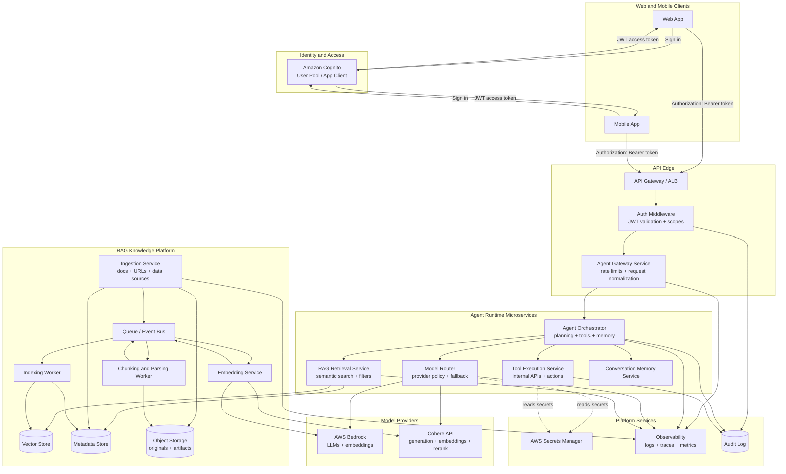

# AI Agent Managed Service

A cloud-native, multi-tenant AI Agent platform designed for web and mobile applications using a microservices-oriented architecture on AWS.

The platform provides secure access to AI agents through Amazon Cognito authentication, Retrieval-Augmented Generation (RAG), AWS Bedrock foundation models, and Cohere APIs.

---

## Solution Overview

This managed service enables application teams to integrate conversational AI, knowledge assistants, task automation, and agentic workflows into mobile and web products without directly managing AI infrastructure.

# Mermaid Diagram



### Key Capabilities

- AI Agent orchestration
- AWS Bedrock model access
- Cohere API integration
- Retrieval-Augmented Generation (RAG)
- Secure Cognito-based authentication
- Multi-tenant architecture
- Event-driven microservices
- Managed vector search
- Knowledge base ingestion
- Audit and observability
- API-first design for mobile and web clients

---

## Repository Structure

```text
/
├── README.md
├── architecture.md
├── mermaid-diagram.md
├── api-and-auth.md
├── rag-training.md
└── deployment.md
```

---

## Documentation Guide

### architecture.md

Provides the logical architecture of the platform.

#### Topics Covered

- Service responsibilities
- Microservice boundaries
- AI orchestration layer
- Model provider integrations
- Event-driven communication
- Data flow between services
- Security model

#### Use This Document For

- Designing new services
- Understanding service ownership
- Planning platform extensions

---

### mermaid-diagram.md

Contains the visual architecture diagram.

#### Topics Covered

- Client entry points
- Authentication flow
- AI request lifecycle
- RAG ingestion workflow
- Retrieval workflow
- Model provider integrations
- Event-driven integrations

#### Use This Document For

- Creating architecture presentations
- Onboarding developers
- Explaining system relationships

---

### api-and-auth.md

Describes API architecture and authentication.

#### Topics Covered

- Cognito authentication
- JWT token validation
- API Gateway integration
- Authorization patterns
- Agent API endpoints
- Tenant isolation

#### Use This Document For

- Building mobile applications
- Building web applications
- Integrating backend services

---

### rag-training.md

Explains the Retrieval-Augmented Generation pipeline.

#### Topics Covered

- Document ingestion
- Chunking strategy
- Embedding generation
- Vector indexing
- Retrieval process
- Knowledge base updates

#### Use This Document For

- Building enterprise knowledge assistants
- Managing content ingestion
- Designing search and retrieval workflows

---

### deployment.md

Defines infrastructure and deployment guidance.

#### Topics Covered

- AWS services
- Container orchestration
- Scaling
- Networking
- Security
- Monitoring
- Disaster recovery

#### Use This Document For

- Deploying environments
- Planning production rollout
- Managing infrastructure operations

---

# Architecture Diagram Walkthrough

The platform follows a microservices architecture with clear separation between client access, AI orchestration, retrieval services, and model providers.

---

## 1. Client Layer

### Components

- Web Applications
- Mobile Applications

Applications authenticate using Amazon Cognito and receive a JWT access token.

### Responsibilities

- User authentication
- Session management
- Agent interaction
- API consumption

---

## 2. Identity Layer

### Amazon Cognito

Cognito serves as the identity provider.

### Responsibilities

- User authentication
- User pools
- JWT issuance
- Access control

### Authentication Flow

```text
User Login
   ↓
Cognito
   ↓
JWT Token
   ↓
API Requests
```

---

## 3. API Layer

### Amazon API Gateway

Acts as the secure entry point for all requests.

### Responsibilities

- JWT validation
- Rate limiting
- API routing
- Request logging

### Request Flow

```text
Client
   ↓
API Gateway
   ↓
Microservices
```

---

## 4. Agent Orchestration Layer

### Agent Orchestrator Service

The central intelligence layer.

### Responsibilities

- Intent processing
- Agent workflow execution
- Tool calling
- RAG coordination
- Model routing

The orchestrator decides:

- Whether retrieval is required
- Whether to use Bedrock
- Whether to use Cohere
- Which agent workflow should execute

---

## 5. Foundation Model Layer

### AWS Bedrock

Used for:

- Anthropic Claude
- Amazon Nova
- Meta Llama
- Other Bedrock-supported models

#### Responsibilities

- Reasoning
- Generation
- Summarization
- Agent task execution

---

### Cohere API

Used for:

- Embeddings
- Reranking
- Generation
- Classification

#### Responsibilities

- Semantic search improvements
- Retrieval ranking
- Specialized NLP workloads

---

## 6. Retrieval Layer

### Retrieval Service

Provides context retrieval before model invocation.

#### Responsibilities

- Vector search
- Document retrieval
- Context assembly
- Prompt augmentation

#### Retrieval Flow

```text
Question
   ↓
Vector Search
   ↓
Relevant Documents
   ↓
Prompt Context
```

---

## 7. Knowledge Layer

### Vector Database

Stores embeddings generated from knowledge sources.

#### Supported Options

- Amazon OpenSearch Vector Engine
- Aurora PostgreSQL + pgvector
- Pinecone
- Weaviate

#### Responsibilities

- Similarity search
- Semantic retrieval
- Knowledge indexing

---

### S3 Knowledge Repository

Stores source documents.

#### Supported Content

- PDF
- DOCX
- Markdown
- HTML
- JSON
- CSV

#### Responsibilities

- Durable storage
- Versioning
- Document lifecycle management

---

## 8. RAG Ingestion Pipeline

### RAG Ingestion Service

Processes uploaded knowledge.

#### Responsibilities

- Document parsing
- Chunking
- Metadata extraction
- Embedding generation requests

#### Flow

```text
Document Upload
      ↓
Chunking
      ↓
Embedding Generation
      ↓
Vector Storage
```

---

### Embedding Service

Generates vector representations.

#### Supported Providers

- Cohere Embeddings
- Amazon Titan Embeddings (Bedrock)

#### Outputs

- Document vectors
- Metadata
- Search index entries

---

## 9. Event Layer

### Amazon EventBridge / SQS

Provides asynchronous communication between services.

#### Responsibilities

- Workflow events
- Notifications
- Training jobs
- Audit events
- Retry handling

#### Benefits

- Loose coupling
- Scalability
- Fault tolerance

---

## 10. Observability Layer

### Monitoring & Audit Services

Provides platform visibility and compliance support.

#### Responsibilities

- Metrics
- Logs
- Distributed tracing
- Security audits
- Agent activity tracking

#### Recommended AWS Services

- CloudWatch
- AWS X-Ray
- OpenSearch
- Security Hub

---

# End-to-End Request Flow

```text
1. User authenticates via Cognito
2. JWT token issued
3. Client calls API Gateway
4. API Gateway validates token
5. Request routed to Agent Orchestrator
6. Orchestrator determines retrieval needs
7. Retrieval Service queries Vector Store
8. Context returned
9. Bedrock or Cohere invoked
10. Response generated
11. Audit event published
12. Response returned to client
```

---

# Technology Stack

| Layer | Technology |
|---------|---------|
| Identity | Amazon Cognito |
| API | Amazon API Gateway |
| AI Models | AWS Bedrock |
| AI Models | Cohere |
| Storage | Amazon S3 |
| Vector Search | OpenSearch / pgvector |
| Messaging | EventBridge / SQS |
| Containers | ECS Fargate / EKS |
| Monitoring | CloudWatch / X-Ray |
| Security | IAM / KMS / WAF |

---

# Future Enhancements

Potential roadmap items:

- Multi-agent collaboration
- MCP server integration
- Agent memory services
- Human-in-the-loop approvals
- Knowledge graph augmentation
- Fine-tuning workflows
- Bedrock Knowledge Bases integration
- Bedrock Agents integration
- Cross-tenant governance controls

---

# License

The Unlicense

---

# Contributors

Architecture Team  
Platform Engineering Team  
AI Engineering Team