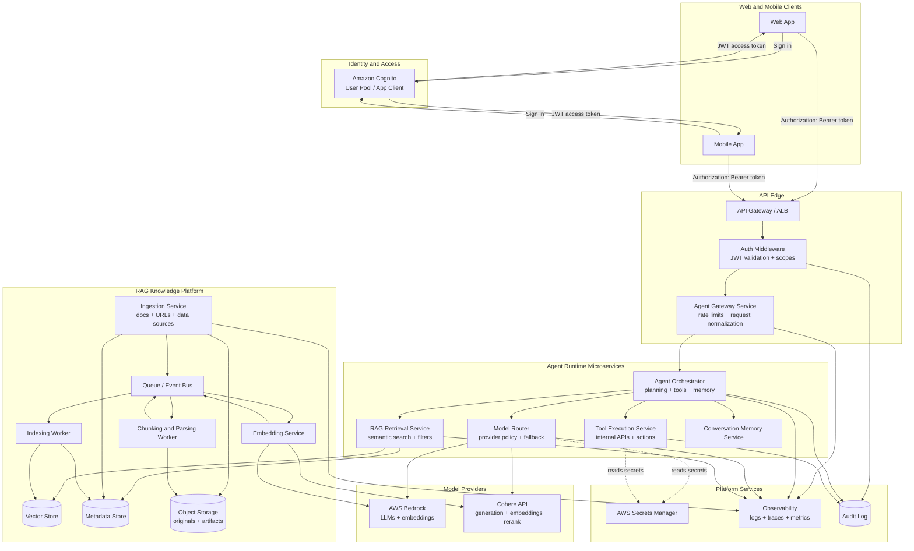

# Mermaid Diagram

```mermaid
flowchart TD
    subgraph Clients[Web and Mobile Clients]
        Web[Web App]
        Mobile[Mobile App]
    end

    subgraph Identity[Identity and Access]
        Cognito[Amazon Cognito\nUser Pool / App Client]
    end

    subgraph Edge[API Edge]
        APIGW[API Gateway / ALB]
        Auth[Auth Middleware\nJWT validation + scopes]
        Gateway[Agent Gateway Service\nrate limits + request normalization]
    end

    subgraph AgentRuntime[Agent Runtime Microservices]
        Orchestrator[Agent Orchestrator\nplanning + tools + memory]
        ModelRouter[Model Router\nprovider policy + fallback]
        RAG[RAG Retrieval Service\nsemantic search + filters]
        Tools[Tool Execution Service\ninternal APIs + actions]
        Memory[Conversation Memory Service]
    end

    subgraph ModelProviders[Model Providers]
        Bedrock[AWS Bedrock\nLLMs + embeddings]
        Cohere[Cohere API\ngeneration + embeddings + rerank]
    end

    subgraph Knowledge[RAG Knowledge Platform]
        Ingest[Ingestion Service\ndocs + URLs + data sources]
        Chunk[Chunking and Parsing Worker]
        Embed[Embedding Service]
        Index[Indexing Worker]
        Vector[(Vector Store)]
        Metadata[(Metadata Store)]
        ObjectStore[(Object Storage\noriginals + artifacts)]
        Queue[Queue / Event Bus]
    end

    subgraph Platform[Platform Services]
        Secrets[AWS Secrets Manager]
        Obs[Observability\nlogs + traces + metrics]
        Audit[(Audit Log)]
    end

    Web -->|Sign in| Cognito
    Mobile -->|Sign in| Cognito
    Cognito -->|JWT access token| Web
    Cognito -->|JWT access token| Mobile

    Web -->|Authorization: Bearer token| APIGW
    Mobile -->|Authorization: Bearer token| APIGW
    APIGW --> Auth
    Auth --> Gateway
    Gateway --> Orchestrator

    Orchestrator --> RAG
    Orchestrator --> Tools
    Orchestrator --> Memory
    Orchestrator --> ModelRouter

    RAG --> Vector
    RAG --> Metadata
    ModelRouter --> Bedrock
    ModelRouter --> Cohere
    Embed --> Bedrock
    Embed --> Cohere

    Ingest --> ObjectStore
    Ingest --> Metadata
    Ingest --> Queue
    Queue --> Chunk
    Chunk --> ObjectStore
    Chunk --> Queue
    Queue --> Embed
    Embed --> Queue
    Queue --> Index
    Index --> Vector
    Index --> Metadata

    Gateway --> Obs
    Orchestrator --> Obs
    ModelRouter --> Obs
    RAG --> Obs
    Ingest --> Obs

    Auth --> Audit
    Orchestrator --> Audit
    Tools --> Audit

    ModelRouter -. reads secrets .-> Secrets
    Tools -. reads secrets .-> Secrets
```
